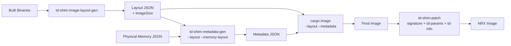

# Building A Custom NRX Image

This document describes how to build a td-shim image tailored for NRX
deployment. NRX images strip optional sections (Config, Mailbox) and use
custom metadata (signature, TD_PARAMS, TD_INFO) to identify the image to
the NRX loader.

## Overview

A td-shim NRX image consists of several sections laid out contiguously in a
binary file:

| Section | Purpose |
|---------|---------|
| TdParams | TD parameters passed to the guest |
| TempStack | Temporary stack used during early boot |
| TempHeap | Temporary heap used during early boot |
| Payload | The guest payload (e.g., a kernel or firmware) |
| TdInfo | TD measurement/info structure |
| Metadata | TDX metadata descriptor table |
| IPL (td-shim) | Initial Program Loader — the td-shim ELF binary |
| ResetVector | x86 reset vector code |

NRX builds use the following feature flags to strip unnecessary sections:
- `no-config` — removes Config section
- `no-mailbox` — removes Mailbox section
- `no-tdvmcall` — disables TDVMCALL interface
- `no-tdaccept` — disables TD memory acceptance (VMM handles via PAGE_AUG)
- `no-metadata-checks` — disables attribute validation (attributes are zeroed)

> **Note:** These feature flags are subject to change and may be unified under a
> single `nrx` feature flag in the future.

### NRX Build Pipeline

1. Build td-shim + payload with NRX feature flags.
2. Run `td-shim-image-layout-gen` to compute section sizes from the actual
   artifacts. This step produces a layout JSON **including ImageSize**.
3. Run `td-shim-metadata-gen --layout --memory-layout` to produce the TDX
   metadata JSON (including PermMem regions for VMM-allocated guest memory).
4. Rebuild td-shim with the generated layout and metadata
   (via `cargo image --layout --metadata`).
5. Validate with `td-shim-checker`.
6. Patch the image with NRX-specific metadata (signature, TD_PARAMS, TD_INFO).



### Quick Start

A complete NRX build using the built-in example payload:

```bash
NRX_FEATURES="no-config,no-mailbox,no-tdvmcall,no-tdaccept,no-metadata-checks"

# ---- Step 1: Initial build (produces payload, IPL, reset vector) ----
cargo image --example-payload --release --features "${NRX_FEATURES}"

# ---- Step 2: Compute image layout from actual artifact sizes ----
cargo run -p td-shim-tools --bin td-shim-image-layout-gen -- \
    --project-root . \
    --payload-binary example \
    --cargo-build-directory release \
    --template td-shim-tools/etc/sample_nrx_image_template.json \
    --output target/config/image_layout.generated.json

# ---- Step 3: Generate TDX metadata from image layout + physical memory ----
cargo run -p td-shim-tools --bin td-shim-metadata-gen -- \
    --layout target/config/image_layout.generated.json \
    --memory-layout td-shim-tools/etc/sample_nrx_physical_memory.json \
    --out target/config/nrx_metadata.json

# ---- Step 4: Rebuild td-shim with the computed layout and metadata ----
cargo image --example-payload --release \
    --features "${NRX_FEATURES}" \
    --layout target/config/image_layout.generated.json \
    --metadata target/config/nrx_metadata.json

# ---- Step 5: Validate ----
cargo run -p td-shim-tools --bin td-shim-checker -- target/release/final.bin

# ---- Step 6: Patch for NRX ----
cargo run -p td-shim-tools --bin td-shim-patch -- tdx-metadata \
    --in target/release/final.bin \
    --out target/release/final.bin \
    --signature 0x58524E5F

cargo run -p td-shim-tools --bin td-shim-patch -- td-params \
    --in target/release/final.bin \
    --out target/release/final.bin \
    --tdparams td-shim-tools/etc/sample_td_params.json

cargo run -p td-shim-tools --bin td-shim-patch -- td-info \
    --in target/release/final.bin \
    --out target/release/final.bin \
    --guid ffffffff-ffff-ffff-ffff-ffffffffffff \
    --version 1.0.0 \
    --svn 1 \
    --payload-info path/to/nrx_info.bin
```

> **Note:** After patching the metadata signature (step 6), the image will no
> longer pass the stock `td-shim-checker` validation because the checker expects
> the original TDX metadata signature. The patched image is intended for the NRX
> loader that recognizes the `0x58524E5F` ("_NRX") signature.

An automated version of this workflow is available as
`sh_script/test_custom_nrx_image_build.sh`.

---

The following sections document each tool in detail.

## td-shim-image-layout-gen

Computes a td-shim image layout from built artifacts and a JSON layout template.

### What It Does

1. Reads a layout template (JSON with section names and hex sizes).
2. Measures actual payload, IPL (td-shim ELF), and reset vector binary sizes.
3. Adds firmware volume (FV) header overhead (~256 bytes per section).
4. Aligns all sections to 4 KiB boundaries.
5. Outputs `image_layout.generated.json`.

### Usage

```bash
td-shim-image-layout-gen --project-root <path> --payload-binary <name> [OPTIONS]
```

### Arguments

| Argument | Required | Default | Description |
|----------|----------|---------|-------------|
| `--project-root <path>` | yes | — | Root directory of the project |
| `--payload-binary <name>` | yes | — | Payload binary filename |
| `--cargo-target-dir <dir>` | no | `target/` | Cargo target directory |
| `--build-target <target>` | no | `x86_64-unknown-none` | Build target triple |
| `--cargo-build-directory <dir>` | no | `release` | Build profile directory |
| `--ipl-binary <name>` | no | `td-shim` | IPL binary name |
| `--reset-vector-binary <name>` | no | `ResetVector.bin` | Reset vector binary name |
| `--template <path>` | no | built-in default | Layout template JSON |
| `--output <path>` | no | `target/config/image_layout.generated.json` | Output file |

### Template Format

The NRX template omits Config and Mailbox. Sections with `"0x0"` are measured
from build artifacts:

```json
{
    "TdParams": "0x1000",
    "TempStack": "0x20000",
    "TempHeap": "0x20000",
    "TdInfo": "0x1000",
    "Metadata": "0x1000",
    "Payload": "0x0",
    "Ipl": "0x0",
    "ResetVector": "0x0"
}
```

Optional fields: `Config`, `Mailbox`, `TdInfo`, `TdParams`, `ImageSize`.

> **Note:** `ImageSize` is computed automatically from the sum of all sections.
> If provided in the template, it serves as a minimum (preserving extra padding).
> If omitted, the tool calculates the exact minimum required size.

The NRX template is at `td-shim-tools/etc/sample_nrx_image_template.json`.

### Example

```bash
cargo run -p td-shim-tools --bin td-shim-image-layout-gen -- \
    --project-root . \
    --payload-binary example \
    --cargo-build-directory release \
    --template td-shim-tools/etc/sample_nrx_image_template.json \
    --output target/config/image_layout.generated.json
```

The generated layout can then be passed to `cargo image --layout`.

---

## td-shim-metadata-gen

Generates a TDX metadata JSON file consumable by `td-shim-ld --metadata`.

### What It Does

1. Reads an image layout JSON (`--layout`) and computes TDX metadata sections.
2. Optionally reads physical memory regions (`--memory-layout`) for PermMem/TempMem.
3. Validates that no memory regions overlap.
4. Writes the output JSON.

### Usage

```bash
# From an image layout JSON (with optional physical memory regions)
td-shim-metadata-gen --layout <path> [--memory-layout <path>] --out <path>
```

### Arguments

| Argument | Required | Description |
|----------|----------|-------------|
| `--layout <path>` | yes | Image layout JSON (from td-shim-image-layout-gen) |
| `--memory-layout <path>` | no | Physical memory JSON with PermMem/TempMem regions |
| `--out <path>` | yes | Output metadata JSON file path |

### --layout Mode

When using `--layout`, the tool reads the image layout JSON (as produced by
`td-shim-image-layout-gen`) and computes metadata section offsets from the
section order. TdParams and TdInfo sections are included only if present in
the layout with non-zero size.

When `--memory-layout` is provided, PermMem and/or TempMem regions from the
physical memory JSON are appended to the metadata. These describe guest physical
address ranges that the VMM allocates (via PAGE_AUG for PermMem).

The tool validates that no memory regions overlap.

```bash
cargo run -p td-shim-tools --bin td-shim-metadata-gen -- \
    --layout target/config/image_layout.generated.json \
    --memory-layout td-shim-tools/etc/sample_nrx_physical_memory.json \
    --out target/config/nrx_metadata.json
```

### Physical Memory Layout Format

```json
{
    "PermMem": [
        { "address": "0x0", "size": "0x2000000" }
    ],
    "TempMem": [
        { "address": "0x10000000", "size": "0x1000000" }
    ]
}
```

Both arrays are optional. Each entry specifies a guest physical address range.
Multiple regions of the same type are supported. Sizes are u64 (supports >4GB).

A sample is available at `td-shim-tools/etc/sample_nrx_physical_memory.json`.

### Output Format

The generated metadata JSON follows the format expected by `td-shim-ld --metadata`:

```json
{
    "Sections": [
        {
            "Type": "BFV",
            "Attributes": "0x1",
            "DataOffset": "0x57000",
            "RawDataSize": "0x21000",
            "MemoryAddress": "0xFFF8F000",
            "MemoryDataSize": "0x21000"
        },
        {
            "Type": "PermMem",
            "Attributes": "0x2",
            "DataOffset": "0x0",
            "RawDataSize": "0x0",
            "MemoryAddress": "0x0",
            "MemoryDataSize": "0x2000000"
        }
    ]
}
```

### Valid Section Types

`BFV`, `CFV`, `TD_HOB`, `TempMem`, `PermMem`, `Payload`, `PayloadParam`, `TdInfo`, `TdParams`

---

## Building

The default feature set of `td-shim-tools` includes both tools:

```bash
cargo build -p td-shim-tools
```

To build each tool individually:

```bash
cargo build -p td-shim-tools --no-default-features --features layout-gen
cargo build -p td-shim-tools --no-default-features --features metadata-gen
cargo build -p td-shim-tools --no-default-features --features patcher
```

## Installing

```bash
cargo install --path td-shim-tools
```

Or via the Makefile:

```bash
make install
```

---

## td-shim-patch

Patches an existing td-shim firmware image in-place. Use this tool after linking
to inject runtime-specific data (metadata signatures, TD parameters, TD info
blobs) without rebuilding from source.

### Subcommands

| Subcommand | Purpose |
|------------|---------|
| `tdx-metadata` | Overwrite the TDX metadata signature and zero section attributes |
| `td-params` | Write the TD_PARAMS section from a JSON description |
| `td-info` | Write a TD_INFO header (GUID + version + SVN) and payload blob |

### Usage

```bash
td-shim-patch <subcommand> [options]
```

### Patching Example

Patching a linked td-shim image for NRX deployment (metadata signature,
TD parameters, and TD_INFO):

```bash
# Set NRX signature (0x58524E5F = "_NRX") and zero attributes
cargo run -p td-shim-tools --bin td-shim-patch -- tdx-metadata \
    --in target/release/final.bin \
    --out target/release/final.bin \
    --signature 0x58524E5F

# Write TD_PARAMS from a JSON file
cargo run -p td-shim-tools --bin td-shim-patch -- td-params \
    --in target/release/final.bin \
    --out target/release/final.bin \
    --tdparams td-shim-tools/etc/sample_td_params.json

# Write TD_INFO with NRX GUID, version, SVN, and payload info blob
cargo run -p td-shim-tools --bin td-shim-patch -- td-info \
    --in target/release/final.bin \
    --out target/release/final.bin \
    --guid ffffffff-ffff-ffff-ffff-ffffffffffff \
    --version 1.0.0 \
    --svn 1 \
    --payload-info path/to/nrx_info.bin
```

### Subcommand Details

#### tdx-metadata

Overwrites the 4-byte TDX metadata signature at the descriptor offset and zeros
all section attribute fields. Useful for re-targeting images to alternative
metadata consumers (e.g., NRX instead of stock TDX).

```bash
td-shim-patch tdx-metadata --in <image> --out <image> --signature <hex>
```

| Argument | Required | Description |
|----------|----------|-------------|
| `--in <path>` | yes | Input firmware image |
| `--out <path>` | yes | Output firmware image (can be same as input) |
| `--signature <hex>` | yes | New 4-byte signature value (e.g., `0x58524E5F`) |

#### td-params

Writes a 1024-byte TD_PARAMS structure into the image's TD_PARAMS section.
The JSON file must serialize to exactly 1024 bytes following the TDX Module
spec layout.

```bash
td-shim-patch td-params --in <image> --out <image> --tdparams <json>
```

| Argument | Required | Description |
|----------|----------|-------------|
| `--in <path>` | yes | Input firmware image |
| `--out <path>` | yes | Output firmware image |
| `--tdparams <path>` | yes | JSON file describing TD_PARAMS fields |

#### td-info

Writes a 28-byte generic header (GUID, length, version, SVN) followed by an
opaque payload blob into the TD_INFO section. The GUID identifies the TD type;
the blob format depends on the specific deployment.

```bash
td-shim-patch td-info --in <image> --out <image> --guid <guid> \
    --version <a.b.c> --svn <n> --payload-info <blob>
```

| Argument | Required | Description |
|----------|----------|-------------|
| `--in <path>` | yes | Input firmware image |
| `--out <path>` | yes | Output firmware image |
| `--guid <guid>` | yes | TD type GUID (`xxxxxxxx-xxxx-xxxx-xxxx-xxxxxxxxxxxx`) |
| `--version <a.b.c>` | yes | Release version (major.minor.update) |
| `--svn <n>` | yes | Security Version Number |
| `--payload-info <path>` | yes | Binary blob with TD-type-specific info |